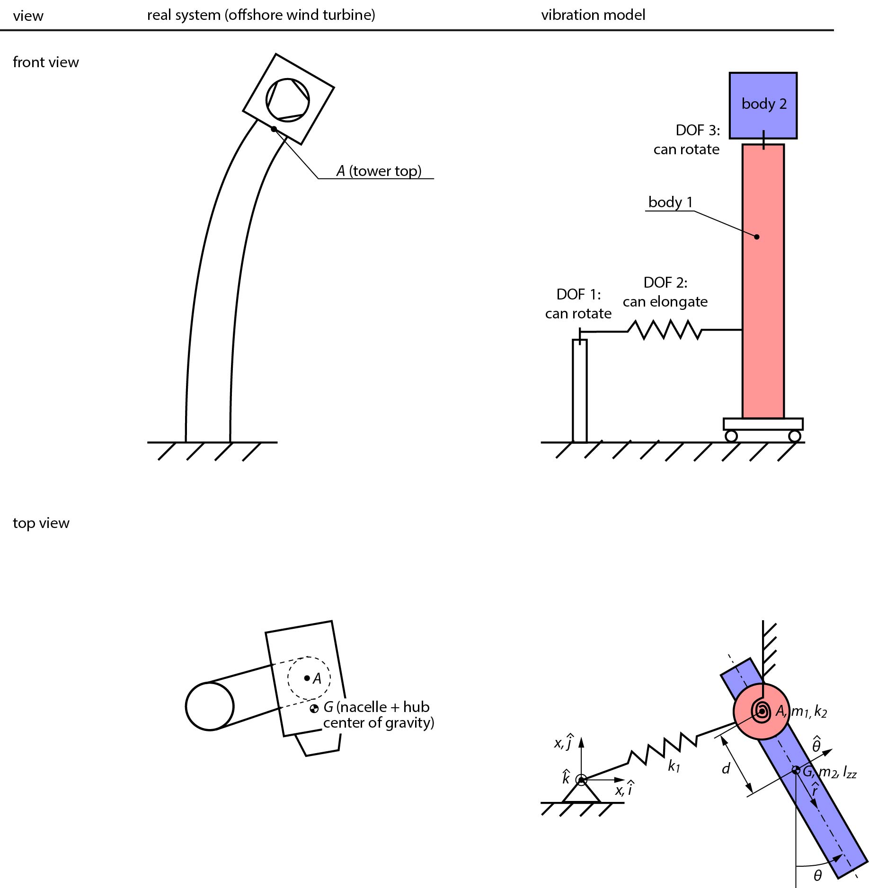

# Repo for "A three degrees of freedom vibration model for a partially installed wind turbine"

The tower's oscillation is modeled as a discrete system with three degrees of freedom.

To simulate the dynamics, run the file [simulate_3dof.m](simulate_3dof.m) with Matlab.

This work builds upon a preprint: https://github.com/k323r/2021_preprint_eccentric-mass

## Sketch of the model

